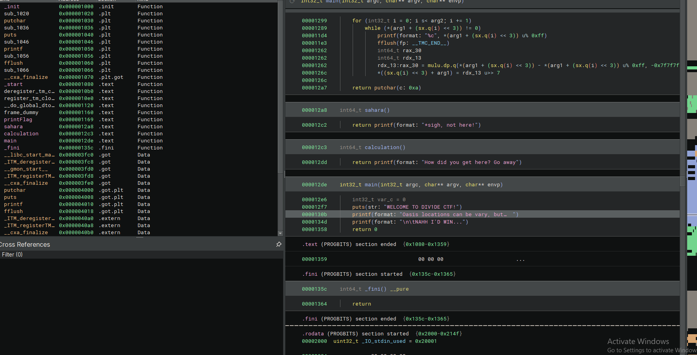
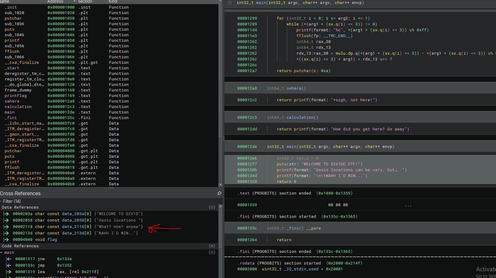
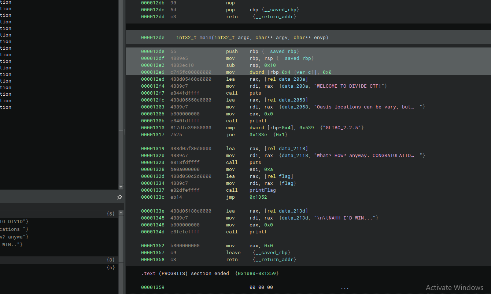
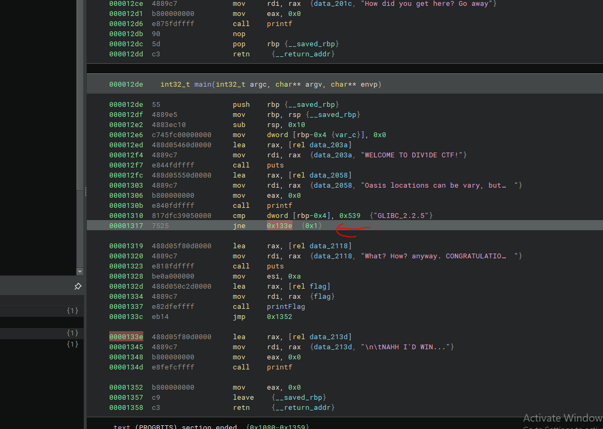
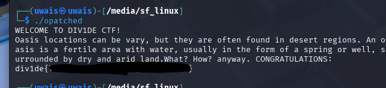

### OASIS

Reverse Engineering.

download binja(binary ninja)

and see thru

go to the main function

after that analyze it from here i can that its displaying and there are some functions around the main 

when i select the entire main function you get this

so i change it to dissambly view

see here the jne function which jumps to the NAHH ID WIN(LOL)

so there are 2 ways i think, one patch it to never branch or make it jump to the function lets try

i patch it and make it to never branch and it redirect it to print flag and this happens, okay lets try.

i run it in linux

ta daaa flag

to learn binja go find online videos, im nnoob too