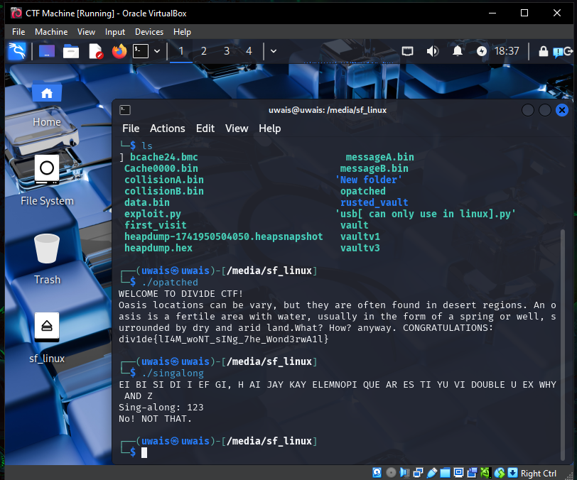
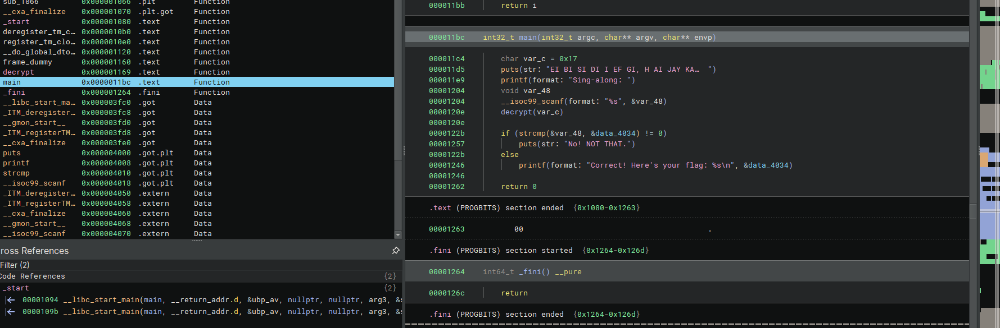
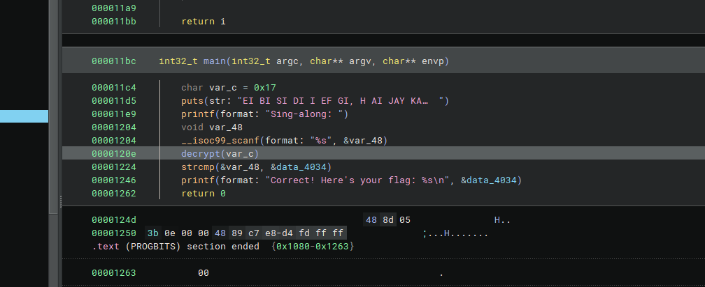
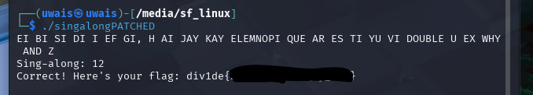

###SINGALONG

First i ran the file knowing its linux, you could also check the type and stuff but thats not my way

hmmm

i seee binja time

i see main i see one if else 

so i just patch it so it doesnt run the if function and never branch so i get the flag

taddaaaa flag fuyoooooo